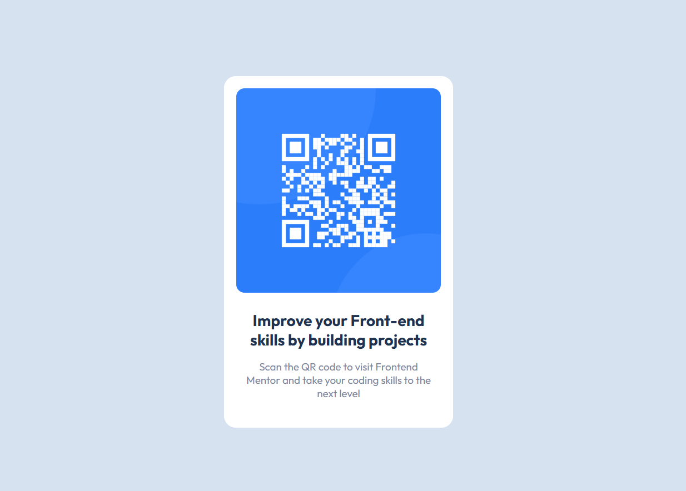

# Frontend Mentor - QR code component

## The challenge
The challenge is based on creating a QR Code card that gives access to the Frontend Mentor website. 
The code is base on only two languages (HTML and CSS) and is very simple and easy.

## Building the project
I started by doing the HTML part because it is the simplest. As the texts were already previously 
organized by the site, I only needed to create a few divs to make my organization easier. After that,
I used the basics of CSS to determine the next font and its type. In addition, I just used some parameters 
already known from some old sites I made and organized everything in detail so that I didn't have to 
mess with it again.

## Links
Github: https://github.com/EduFlp/qr-code-component-main
Frontend Mentor: https://www.frontendmentor.io/profile/EduFlp

## Built with
HTML 5
CSS 3

## What I leraned?
I made this project to reviwe some basic HTML and CSS concepts. I feel like I haven't learned everything
completely, so it's always good to review somes topics to get a better idea of how to progress correctly.
In addition, my CSS improved a lot and I was able to have more notions of how to expand my knowledge about
HTML. 

